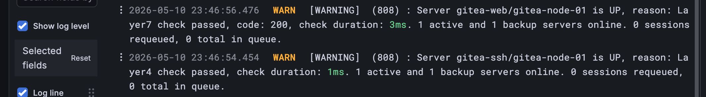

# Отчет о тестировании системы

p.s. если не грузят картинки, включите vpn =)

## 1. Архитектура стенда


## 2. Базовый функционал и Observability 

**2.1. Сбор и агрегация логов (Loki, Promtail)**
Логи сервисов корректно доставляются, индексируются и доступны для поиска.

_Например, Зарегаем пользователя_


**2.2. Мониторинг приложения (Gitea, Prometheus)**
Экспортер Gitea активен. Метрики собираются штатно.

_на дашборде видно, что появился пользователь_

Приложение корректно обрабатывает создание пользователей и репозиториев, изменения мгновенно отражаются в Grafana.

_создали пару репозиториев, поставили звезд и тд._


**2.3. Системные метрики (Node Exporter)**
Утилизация CPU, RAM, Disk и Network фиксируется по каждому узлу кластера.


**2.4. Мониторинг кластера СУБД (PostgreSQL Exporter)**
Состояние репликации и метрики БД


---

## 3. Сценарии отказа

### Отказ Application-узла (gitea-node-01)
* **Действие:** Искусственная остановка контейнера `gitea-node-01`.
* **Поведение системы:** Зафиксирован downtime (около 1 минуты) до перерасчета состояния кластера.
  
* **Восстановление:** Балансировщик мгновенно пометил gitea-node-01 как DOWN и исключил её из ротации. Весь 100% трафика начал уходить на оставшуюся живую ноду gitea-node-02 Доступность сервиса восстановлена.
  
  
* **Алертинг:** Сработало правило в Alertmanager, доставлено email-уведомление о падении узла. Инцидент зафиксирован в дашборде алертов.
  

### Демонстрация восстановления gitea-node-01

1. Поднимаем обратно `gitea-node-01` (если снесло полностью gitea-node-01, то запускаем ансибл плейбук с установкой именно gitea-node-01 )

2. Текущий primary прокси увидел что `gitea-node-01` и маршрутизирует траффик через нее, что видно в логгах:
 

3. Для подтверждения можно стопнуть `gitea-node-02`  и проверить доступность. 
```
~/gitops-c-stand main !2 > docker stop gitea-node-02                           
gitea-node-02

~/gitops-c-stand main !2 > curl -I http://localhost:3002
HTTP/1.1 200 OK
date: Sun, 10 May 2026 21:17:11 GMT


~/gitops-c-stand main !2 > 
```


### Отказ Master-узла БД
* **Действие:** Искусственная остановка активного узла PostgreSQL.
* **Поведение системы:** Gitea сохраняет работоспособность. Создание новых файлов (запись в БД) проходит успешно.
  
* **Восстановление:** Демон `repmgrd` корректно отработал сценарий failover и повысил реплику `db-node-02` до статуса master.
  
* **Алертинг:** Доставлено email-уведомление об отказе узла БД.
  

### Демонстрация восстановления db-node-01

Шаги такие:
1. по-хорошему надо приостановить gitea, чтобы во время восттановления никто из пользователей случайно все не сломал при смене роли в баз данных, но так как я - единственный пользователь, я параллельно ничего вставлять в бд не буду. А еще алерты выключить временно
2. восстанавливаем `docker start db-node-01` и сразу же останавливаем  бд1 `docker exec db-node-01 pg_ctlcluster 14 main stop` (если снесло полностью db-node-01, то запускаем ансибл плейбук с установкой именно db-node-01 )
3. очищаем бд1 `docker exec db-node-01 bash -c "rm -rf /var/lib/postgresql/14/main/*"`
4. клоним бд2 в бд1: `docker exec -it -u postgres db-node-01 repmgr -h 172.20.0.22 -U repmgr -d repmgr -f /etc/repmgr.conf standby clone --force`
5. запускаем бд1 и делаем его standby `docker exec -it -u postgres db-node-01 repmgr -f /etc/repmgr.conf standby register --force`
6. стопаем бд2 `docker exec db-node-02 pg_ctlcluster 14 main stop`
7. делаем бд1 Primary `docker exec -it -u postgres db-node-01 repmgr -f /etc/repmgr.conf standby promote`
8. чистим бд2 `docker exec db-node-02 bash -c "rm -rf /var/lib/postgresql/14/main/*"`
9. клоним данные с бд1 `docker exec -it -u postgres db-node-02 repmgr -h 172.20.0.21 -U repmgr -d repmgr -f /etc/repmgr.conf standby clone --force`
10. запускаем бд2 `docker exec db-node-02 pg_ctlcluster 14 main start`

11 делаем бд2 standby `docker exec -it -u postgres db-node-02 repmgr -f /etc/repmgr.conf standby register --force`

12. проверка `docker exec -it -u postgres db-node-01 repmgr -f /etc/repmgr.conf cluster show`

13. перезапускаем демона автофейловера
`docker exec db-node-02 systemctl restart repmgrd`
`docker exec db-node-02 systemctl status repmgrd`
`docker exec db-node-01 systemctl restart repmgrd`
`docker exec db-node-01 systemctl status repmgrd`

демо:
```
~/gitops-c-stand main !2 ?2 > docker start db-node-01
db-node-01

~/gitops-c-stand main !2 ?2 > docker exec db-node-01 pg_ctlcluster 14 main stop

~/gitops-c-stand main !2 ?2 > docker exec db-node-01 bash -c "rm -rf /var/lib/postgresql/14/main/*"

~/gitops-c-stand main !2 ?2 > docker exec -it -u postgres db-node-01 repmgr -h 172.20.0.22 -U repmgr -d repmgr -f /etc/repmgr.conf standby clone --force
NOTICE: destination directory "/var/lib/postgresql/14/main" provided
INFO: connecting to source node
DETAIL: connection string is: host=172.20.0.22 user=repmgr dbname=repmgr
DETAIL: current installation size is 50 MB
INFO: replication slot usage not requested;  no replication slot will be set up for this standby
NOTICE: checking for available walsenders on the source node (2 required)
NOTICE: checking replication connections can be made to the source server (2 required)
WARNING: data checksums are not enabled and "wal_log_hints" is "off"
DETAIL: pg_rewind requires "wal_log_hints" to be enabled
INFO: checking and correcting permissions on existing directory "/var/lib/postgresql/14/main"
NOTICE: starting backup (using pg_basebackup)...
HINT: this may take some time; consider using the -c/--fast-checkpoint option
INFO: executing:
  pg_basebackup -l "repmgr base backup"  -D /var/lib/postgresql/14/main -h 172.20.0.22 -p 5432 -U repmgr -X stream 
NOTICE: standby clone (using pg_basebackup) complete
NOTICE: you can now start your PostgreSQL server
HINT: for example: pg_ctl -D /var/lib/postgresql/14/main start
HINT: after starting the server, you need to re-register this standby with "repmgr standby register --force" to update the existing node record

~/gitops-c-stand main !2 ?2 > docker exec db-node-01 pg_ctlcluster 14 main start

~/gitops-c-stand main !2 ?2 > docker exec -it -u postgres db-node-01 repmgr -f /etc/repmgr.conf standby register --force
INFO: connecting to local node "db-node-01" (ID: 1)
INFO: connecting to primary database
INFO: standby registration complete
NOTICE: standby node "db-node-01" (ID: 1) successfully registered
                                   

~/gitops-c-stand main !2 ?2 > docker exec db-node-02 pg_ctlcluster 14 main stop

~/gitops-c-stand main !2 ?2 > docker exec -it -u postgres db-node-01 repmgr -f /etc/repmgr.conf standby promote
NOTICE: promoting standby to primary
DETAIL: promoting server "db-node-01" (ID: 1) using pg_promote()
NOTICE: waiting up to 60 seconds (parameter "promote_check_timeout") for promotion to complete
NOTICE: STANDBY PROMOTE successful
DETAIL: server "db-node-01" (ID: 1) was successfully promoted to primary

~/gitops-c-stand main !2 ?2 > docker exec -it -u postgres db-node-01 repmgr -f /etc/repmgr.conf cluster show
 ID | Name       | Role    | Status    | Upstream | Location | Priority | Timeline | Connection string                                          
----+------------+---------+-----------+----------+----------+----------+----------+-------------------------------------------------------------
 1  | db-node-01 | primary | * running |          | default  | 100      | 7        | host=db-node-01 user=repmgr dbname=repmgr connect_timeout=2
 2  | db-node-02 | primary | - failed  | ?        | default  | 100      |          | host=db-node-02 user=repmgr dbname=repmgr connect_timeout=2

WARNING: following issues were detected
  - unable to connect to node "db-node-02" (ID: 2)

HINT: execute with --verbose option to see connection error messages

~/gitops-c-stand main !2 ?2 > docker exec db-node-02 bash -c "rm -rf /var/lib/postgresql/14/main/*"

~/gitops-c-stand main !2 ?2 > docker exec -it -u postgres db-node-02 repmgr -h 172.20.0.21 -U repmgr -d repmgr -f /etc/repmgr.conf standby clone --force
NOTICE: destination directory "/var/lib/postgresql/14/main" provided
INFO: connecting to source node
DETAIL: connection string is: host=172.20.0.21 user=repmgr dbname=repmgr
DETAIL: current installation size is 49 MB
INFO: replication slot usage not requested;  no replication slot will be set up for this standby
NOTICE: checking for available walsenders on the source node (2 required)
NOTICE: checking replication connections can be made to the source server (2 required)
WARNING: data checksums are not enabled and "wal_log_hints" is "off"
DETAIL: pg_rewind requires "wal_log_hints" to be enabled
INFO: checking and correcting permissions on existing directory "/var/lib/postgresql/14/main"
NOTICE: starting backup (using pg_basebackup)...
HINT: this may take some time; consider using the -c/--fast-checkpoint option
INFO: executing:
  pg_basebackup -l "repmgr base backup"  -D /var/lib/postgresql/14/main -h 172.20.0.21 -p 5432 -U repmgr -X stream 
NOTICE: standby clone (using pg_basebackup) complete
NOTICE: you can now start your PostgreSQL server
HINT: for example: pg_ctl -D /var/lib/postgresql/14/main start
HINT: after starting the server, you need to re-register this standby with "repmgr standby register --force" to update the existing node record

~/gitops-c-stand main !2 ?2 > docker exec db-node-02 pg_ctlcluster 14 main start

~/gitops-c-stand main !2 ?2 > docker exec -it -u postgres db-node-02 repmgr -f /etc/repmgr.conf standby register --force
INFO: connecting to local node "db-node-02" (ID: 2)
INFO: connecting to primary database
INFO: standby registration complete
NOTICE: standby node "db-node-02" (ID: 2) successfully registered

~/gitops-c-stand main !2 ?2 > docker exec -it -u postgres db-node-01 repmgr -f /etc/repmgr.conf cluster show
 ID | Name       | Role    | Status    | Upstream   | Location | Priority | Timeline | Connection string                                          
----+------------+---------+-----------+------------+----------+----------+----------+-------------------------------------------------------------
 1  | db-node-01 | primary | * running |            | default  | 100      | 7        | host=db-node-01 user=repmgr dbname=repmgr connect_timeout=2
 2  | db-node-02 | standby |   running | db-node-01 | default  | 100      | 7        | host=db-node-02 user=repmgr dbname=repmgr connect_timeout=2

~/gitops-c-stand main !2 ?2 > 


~/gitops-c-stand main !2 ?2 > docker exec db-node-02 systemctl restart repmgrd
docker exec db-node-02 systemctl status repmgrd
Failed to dump process list for 'repmgrd.service', ignoring: Input/output error
● repmgrd.service - LSB: Start/stop repmgrd
     Loaded: loaded (/etc/init.d/repmgrd; generated)
     Active: active (running) since Mon 2026-05-11 02:05:35 MSK; 44ms ago
       Docs: man:systemd-sysv-generator(8)
    Process: 7323 ExecStart=/etc/init.d/repmgrd start (code=exited, status=0/SUCCESS)
      Tasks: 2 (limit: 9397)
     Memory: 5.9M
        CPU: 34ms
     CGroup: /system.slice/repmgrd.service

May 11 02:05:35 db-node-02 systemd[1]: repmgrd.service: Found left-over process 4356 (repmgrd) in control group while starting unit. Ignoring.
May 11 02:05:35 db-node-02 systemd[1]: This usually indicates unclean termination of a previous run, or service implementation deficiencies.
May 11 02:05:35 db-node-02 systemd[1]: Starting LSB: Start/stop repmgrd...
May 11 02:05:35 db-node-02 repmgrd[7323]:  * Starting PostgreSQL replication management and monitoring daemon repmgrd
May 11 02:05:35 db-node-02 repmgrd[7323]:    ...done.
May 11 02:05:35 db-node-02 systemd[1]: Started LSB: Start/stop repmgrd.

~/gitops-c-stand main !2 ?2 > 
```

на gitea все работает


### Отказ узла хранения (storage-01)
* **Действие:** Остановка узла распределенного хранилища (Ganesha NFS / Gluster).
* **Алертинг:** Доставлено email-уведомление о недоступности storage-узла.
  
* **Поведение системы:** Данные остаются доступны. Операции ввода/вывода (создание файлов) обслуживаются резервным узлом.
  

### Демонстрация восстановления storage-01

Шаги такие:
1. временно на время восстановления вырубаем алерты и gitea
2. запускаем `docker start storage-01` (если storage-01 снесло послностю, то просто перезапускаем плейбук для ноды storage-01)
3. проверяем `docker exec storage-01 systemctl is-active glusterd nfs-ganesha keepalived`
4. проверяем пиринг GlusterFS (Статус должен быть State: Peer in Cluster (Connected))`docker exec storage-01 gluster peer status`
5. `docker exec storage-01 gluster volume list` - получаем имя тома которое используем дальше
6. запускаем синхранизацию `docker exec storage-01 gluster volume heal <VOLUME_NAME_из_5_шага>`
7. проверяем статус
`docker exec storage-01 gluster volume heal <VOLUME_NAME_из_5_шага> info`

8.проверка что VIP правильный `docker exec storage-01 ip addr show eth0 | grep "172.20.0."`


```
~/gitops-c-stand main !2 ?2 > docker start storage-01
storage-01

~/gitops-c-stand main !2 ?2 > docker exec storage-01 systemctl is-active glusterd nfs-ganesha keepalived
active
inactive
active

~/gitops-c-stand main !2 ?2 > docker exec storage-01 gluster peer status
Number of Peers: 1

Hostname: 172.20.0.42
Uuid: 06f2a76a-b3de-4e73-9dee-2dfb784b11ce
State: Peer in Cluster (Connected)

~/gitops-c-stand main !2 ?2 > docker exec storage-01 gluster volume list
gitea_vol

~/gitops-c-stand main !2 ?2 > docker exec storage-01 gluster volume heal gitea_vol    
Launching heal operation to perform index self heal on volume gitea_vol has been successful 
Use heal info commands to check status.

~/gitops-c-stand main !2 ?2 > docker exec storage-01 gluster volume heal gitea_vol info
Brick 172.20.0.41:/data/brick1/gv0
Status: Connected
Number of entries: 0

Brick 172.20.0.42:/data/brick1/gv0
Status: Connected
Number of entries: 0


~/gitops-c-stand main !2 ?2 > docker exec storage-01 ip addr show eth0 | grep "172.20.0."
    inet 172.20.0.41/24 brd 172.20.0.255 scope global eth0
    inet 172.20.0.40/24 scope global secondary eth0
```

после на gitea все работает


### Отказ балансировщика (proxy-01)
* **Действие:** Остановка активного шлюза HAProxy.
* **Поведение системы:** Отказ обработан. Из-за специфики Docker for Mac (изоляция портов хоста) трафик пущен через `proxy-02` (порт 3002), доступность подтверждена.
  
* **Алертинг:** Доставлено email-уведомление об отказе proxy-узла.
  


### Демонстрация восстановления прокси-01

`docker start gitea-proxy-01 (если gitea-proxy-01 снесло послностю, то просто перезапускаем плейбук для ноды gitea-proxy-01)`
и все работает
```
~/gitops-c-stand main !2 ?2 > docker exec gitea-proxy-01 systemctl is-active haproxy keepalived
active
active
```


---

## 4. Резервное копирование
**Проверка подсистемы бэкапов (Restic)**
Автоматизированные задачи (systemd timers) успешно создают дампы БД и файловой системы. Снапшоты регистрируются на централизованном backup-сервере.


## 5. Пример восстановления из снапшота

p.s. До этого этапа создал пользователя Qwental2 и сделал ему 3 репозитория

```
~/gitops-c-stand main !3 ?2 > curl -I http://localhost:3000/Qwental2/rep3/src/branch/main/README.md                     
HTTP/1.1 200 OK
cache-control: max-age=0, private, must-revalidate, no-transform
content-type: text/html; charset=utf-8
set-cookie: i_like_gitea=f72c2e041c67ce6b; Path=/; HttpOnly; SameSite=Lax
x-frame-options: SAMEORIGIN
date: Mon, 11 May 2026 00:19:59 GMT
~/gitops-c-stand main !3 ?2 > 
```


0. Необходимо остановить Gitea на всех узлах, чтобы исключить любые попытки записи или чтения в момент, когда базы данных и хранилище находятся в нестабильном состоянии
```
docker exec gitea-node-01 systemctl stop gitea
docker exec gitea-node-02 systemctl stop gitea
```

1. находим последний снапшот
```
у меня это:
d4873265  2026-05-11 03:00:53  pg-cluster                   /dumpall.sql
ebbd8d43  2026-05-11 03:01:08  storage-cluster              /data/brick1/gv0
```
#### восстановление Storage
2. перемещаем файлы снапшота во временную директорию
```
docker exec storage-01 bash -c "source /etc/restic/restic.env && restic restore ebbd8d43 --target /tmp/restore"
```

3. создаем точку монтирования и подключаем том
```
docker exec storage-01 mkdir -p /mnt/gitea_recovery
docker exec storage-01 mount -t glusterfs localhost:/gitea_vol /mnt/gitea_recovery
```

4. Очищаем данные (эмуляция того что было все удалено)
```
docker exec storage-01 bash -c "rm -rf /mnt/gitea_recovery/*"
docker exec storage-01 bash -c "cp -a /tmp/restore/data/brick1/gv0/* /mnt/gitea_recovery/"
```
5. отмонтируем том и удаляем временные файлы
```
docker exec storage-01 umount /mnt/gitea_recovery
docker exec storage-01 rm -rf /tmp/restore /mnt/gitea_recovery
```
6. Перезапуск NFS Ganesha
```
docker exec storage-01 systemctl restart nfs-ganesha
docker exec storage-02 systemctl restart nfs-ganesha
```
#### восстановление бд из снапшота

7. удаление данных бд и остановка
```
docker exec db-node-01 pg_ctlcluster 14 main stop
docker exec db-node-02 pg_ctlcluster 14 main stop
docker exec db-node-01 bash -c "rm -rf /var/lib/postgresql/14/main/*"
docker exec db-node-02 bash -c "rm -rf /var/lib/postgresql/14/main/*"
```

8. запускаем бд на primary
```
docker exec -it -u postgres db-node-01 /usr/lib/postgresql/14/bin/initdb -D /var/lib/postgresql/14/main
docker exec db-node-01 pg_ctlcluster 14 main start
```
9. извлекаем дамп из снапшота и импортируем в бд
```
docker exec db-node-01 bash -c "source /etc/restic/restic.env && restic restore d4873265 --target /tmp/restore"

docker exec db-node-01 chown -R postgres:postgres /tmp/restore

docker exec -it -u postgres db-node-01 psql -f /tmp/restore/dumpall.sql
docker exec db-node-01 rm -rf /tmp/restore
```

10. регистрация узла как нового Primary в repmgr

```
docker exec -it -u postgres db-node-01 repmgr -f /etc/repmgr.conf primary register --force
```
11. клонирование в db-node-02  и запуск Standby-узла db-node-02

```
docker exec -it -u postgres db-node-02 repmgr -h 172.20.0.21 -U repmgr -d repmgr -f /etc/repmgr.conf standby clone --force
docker exec db-node-02 pg_ctlcluster 14 main start
docker exec -it -u postgres db-node-02 repmgr -f /etc/repmgr.conf standby register --force
```

12. перезапуск repmgrd
```
docker exec db-node-01 systemctl restart repmgrd
docker exec db-node-02 systemctl restart repmgrd
```

13.Ожидание: 01 — primary, 02 — standby
```
docker exec -it -u postgres db-node-01 repmgr -f /etc/repmgr.conf cluster show
```

14. врубаем gitea
```
docker exec gitea-node-01 systemctl start gitea
docker exec gitea-node-02 systemctl start gitea
```

проверка, все восстановилось. все файлы и метаданные восстановлены из снапшота.
```
~/gitops-c-stand main !3 ?2 > curl -I http://localhost:3000/Qwental2/rep3/src/branch/main/README.md
HTTP/1.1 200 OK
cache-control: max-age=0, private, must-revalidate, no-transform
content-type: text/html; charset=utf-8
set-cookie: i_like_gitea=39ecdc9781b83bb8; Path=/; HttpOnly; SameSite=Lax
x-frame-options: SAMEORIGIN
date: Mon, 11 May 2026 00:29:17 GMT

```


